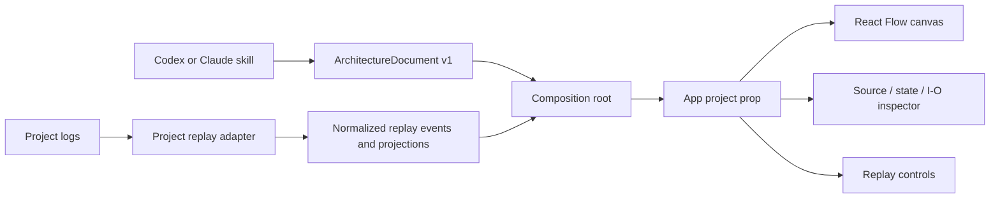

# Modularity review and extension contract

The initial explorer had separate React files, but they shared a Station Control
singleton and interpreted its event schema in the views. Splitting files did not
make them reusable. This refactor makes the project-specific boundary explicit.

| Coupling found                                                                                   | Resulting boundary                                                                                             |
| ------------------------------------------------------------------------------------------------ | -------------------------------------------------------------------------------------------------------------- |
| UI imports bundled Station Control JSON through `model.ts`                                       | `App` accepts an `ArchitectureProject`; a provider scopes the document and indexes to that mounted explorer.   |
| Actor IDs, controller mode strings, hidden edges, colors, and default views in UI logic          | Components/connections declare mode membership; project metadata supplies modes, colors, labels, and defaults. |
| Python language and one GitHub repository assumed by the inspector                               | Each source declares its language and optional source URL. Unindexed components show an explicit empty state.  |
| World-state deltas, oxygen metrics, action classification, and JSONL envelopes interpreted in UI | A `ReplayAdapter` normalizes records and supplies snapshots, metrics, I/O pairs, import, and export.           |
| Captain/Jev/adversary event lookup inside the I/O view                                           | `recordedIO` owns project-specific selection and provenance.                                                   |
| A demo run required merely to render the canvas                                                  | Replay is optional. Static projects still expose components, schemas, source, and state ownership.             |

## Dependency direction

`src/core/types.ts` defines the renderer-independent contracts.
`src/core/validate.ts` checks references, versions, defaults, and normalized runs.
`src/core/project.tsx` provides scoped indexes and visibility selectors to the UI.
`src/projects/station-control/` owns Station Control interpretation;
`src/projects/example/` supplies an independent TypeScript job-queue example.
Only `src/main.tsx`, the host composition root, selects a concrete project.

`npm run check` rejects imports from `projects/` or JSON data in shared UI/core
files. This protects the dependency boundary, not a particular directory naming
style. Contract tests reject broken references; browser tests exercise the same
renderer with both projects and with no replay adapter.

## Add a project

1. Create an `ArchitectureDocument` with `schemaVersion: 1`: components, services,
   directed connections, source definitions, optional field schemas, connection kinds, views,
   modes, and defaults. IDs are local to each document namespace. Source URLs and connection
   contracts/examples are optional; calls and dependencies need no payload schema.
2. Pass `{ document }` as `App`'s `project` prop. No replay data is necessary.
3. If recorded execution exists, implement `ReplayAdapter`. Supply normalized
   runs/events, labels, and defaults. `snapshot`, `metrics`, and `recordedIO`
   are optional: omit unavailable evidence rather than fabricating it.
   `recordedIO` returns `undefined` when unsupported, `null` before a record exists,
   or an input/output pair with provenance. Import/export are optional capabilities.
4. Put raw log parsing, filtering, state reconstruction, and domain classifications
   in that adapter. The shared components must not read raw log fields.
5. Select the project at the host composition root and add a representative browser
   walkthrough. Increment document version when replacing its structure so the
   explorer resets selection and playback state.

A run includes opaque adapter data plus normalized events. The renderer only
formats opaque payloads for inspection; it uses normalized trace IDs, metrics,
and snapshots for behavior. Producers must supply JSON-serializable payloads and
keep projections bounded by the cursor. Initial runs and imported runs are checked
for unresolved component/edge IDs. There is no global mutable project registry.

Source highlighting bundles Python, JSON, JavaScript, and TypeScript locally;
other languages render as plain text. `SourceBlock` is the presentation boundary
for adding more offline grammars.

Try `/` for Station Control, `/?project=example` for the job queue, and
`/?project=static-example` for architecture without recorded execution, and
`/?project=http-example` for a Go HTTP handler with an explicitly illustrative
flow, no message schema, and no state/metrics/I/O projections.

## What remains before packaging a generic skill/plugin

This is a reusable renderer and adapter contract, not an automatic analyzer for
arbitrary repositories. `scripts/generate.py` is still the Station Control Python
extractor and fixture generator. The repository skill at `.agents/skills/architecture-explorer/SKILL.md` guides
Codex or Claude agents to analyze a repository, establish
source/provenance references, generate a validated document, and decide whether a
runtime adapter is possible. It is an agent workflow, not a language parser. Project adapters are trusted application code; the
current validator checks internal consistency, not arbitrary untrusted JSON shapes.

Remaining product work includes language-specific extraction, a distribution/host
entry point, configuration and packaging, and a supported live-event transport if
live inspection is desired. None requires adding domain branches to the canvas or
inspector. Streaming is not implemented here.

The separation follows [single responsibility and dependency inversion](https://www.hellointerview.com/learn/low-level-design/in-a-hurry/design-principles).
Project adapters are an application of [Adapter and Strategy](https://www.hellointerview.com/learn/low-level-design/in-a-hurry/patterns):
Station Control and the job queue expose one renderer-facing interface while owning
their own event semantics. Typed contracts preserve [encapsulation](https://www.hellointerview.com/learn/low-level-design/in-a-hurry/oop-concepts)
of project-specific state interpretation.

## Progressive detail and future code comparison

The presentation now separates `CanvasToolbar` (focus/display), `ComponentBrowser`
(search/navigation), `Graph` (rendering), and `RunPlayer` (recorded execution).
Supporting infrastructure is optional metadata (`Component.detail`), independent
of focus presets and actor IDs. Following a replay or selecting a component reveals
its nodes without changing the focus preset. No PR Lens runtime is required.

The attribute-rich PR Lens example suggests a useful next level of inspection:

- Keep the main canvas at component/service level.
- Expand a selected component into source-file and symbol detail: language, path,
  class/function/component kind, methods, fields, signatures, and return types.
- Add code relationships such as calls/implements/reads/writes only when an adapter
  provides evidence. Current message-contract edges are not an extracted call graph.
- Reserve Added/Modified/Removed, line counts, and signature-change annotations for
  a separate comparison context backed by actual base/head revisions. Current
  source snapshots and replay events cannot establish code-change status.

The current inspector already exposes source paths, definitions, and field types.
Symbol/member classification and comparison metadata are future adapter capabilities,
not inferred badges or extra permanent content on every card. Keep runtime decision
colors distinct from future Git change colors.
