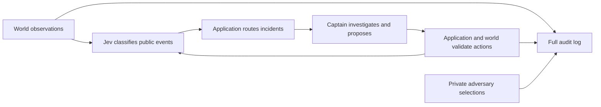

# MVP architecture

Station Control is a single-process application with explicit logical service boundaries.
These are ownership boundaries, not independently deployed services. Keeping them in one
process makes deterministic experiments cheap while preserving replaceable integrations.

## Boundaries and dependency direction

- **World engine and scenarios:** own authoritative resources, hidden faults, sensors,
  scheduled external disruptions, and physical action validation. Only completed work
  changes equipment condition. Authored scenario schedules are seeded; an optional
  adversary can introduce additional disruptions in response to current state.
- **YAML scenario adapter:** parses bounded, validated data into the world's scenario
  definition. Scenario selection and saved snapshots belong to the CLI; the world does
  not read files. Public messages may be deceptive, but cannot directly mutate reality.
- **Mission application:** owns the turn loop, incident lifecycle, routing, follow-up,
  observation history, and action budgets. Controllers propose commands; the application
  and world validate them. Captain and dispatch inputs contain only public observations.
  The adversary receives a separate projection of current truth, excluding future events.
- **Controllers and provider ports:** express decisions over agent-visible evidence.
  Rules are the offline baseline. Captain and dispatch integrations implement contracts
  defined by the consuming application; SDK types stay outside those contracts. The
  optional adversary has its own decision port and a finite disruption action space.
- **Evaluation:** computes separate outcome and decision measures from recorded facts.
  It can use world truth, but does not feed that truth back to controllers. Investigation
  evidence matters; correctly guessing a hidden fault is not itself proof of good reasoning.
- **CLI and persistence:** compose dependencies, validate experiment settings, and write
  structured run records. They do not decide simulation policy. Replay consumes saved
  records; a new experiment reruns the saved scenario with explicit configuration.

Source dependencies point inward: CLI/provider/file adapters → application → world.
The world has no SDK, filesystem, environment, or network dependency. A future UI can call
the mission application without moving policy into HTTP handlers or view code. Additional
subsystems extend world rules and observations; new model vendors replace adapters.

## Trust and failure handling

External reports are evidence, not instructions or proof of physical repairs. Hidden fault
labels stay out of captain and dispatch inputs. The adversary can inspect current faults;
its private context and decisions are audit records, never crew evidence. Agents receive
explicit projections rather than a
serialized world with selected fields removed. Unknown or malformed actions are rejected;
provider errors never grant access or bypass action rules. Network work is bounded and
routine tests use fake providers. Live experiments require explicit budgets and record
configuration and model identifiers; no live model validation is implied by offline tests.

## Event classification and response

The world returns public evidence and private audit transitions through its Facade. The application records all facts through the existing Observer-style EventSink and projects crew-visible activity into immutable PublicEvent values. Private sabotage selections, hidden faults, future schedules, and provider bookkeeping remain in the audit log.

In `jev+llm`, newly published observations and world evidence are classified before incident routing. Jev returns subsystem, safeguard, diagnosis-support, and urgency judgments over each batch. The application applies routing rules: an alert or classification failure always routes; a supported, low-urgency batch stays under monitoring. A concerning observation can create an incident without a preceding report. The captain reviews the public batch and proposes one action per due incident. Physical and closure validation remain authoritative in the application/world.

Action outcomes are classified in a second batch after the turn's captain reviews, including the final turn. Additional work waits until a later turn, preventing recursive classification/action loops. Event sequence IDs identify exactly which events were assessed. Calls use the existing shared budget, input bound, timeout, and failure accounting. This is synchronous Observer-style publication and explicit orchestration; no message broker or asynchronous delivery guarantee is implied.

Design references: [Hello Interview patterns](https://www.hellointerview.com/learn/low-level-design/in-a-hurry/patterns) (Facade and Observer), [design principles](https://www.hellointerview.com/learn/low-level-design/in-a-hurry/design-principles) (single responsibility and dependency inversion), and [OOP concepts](https://www.hellointerview.com/learn/low-level-design/in-a-hurry/oop-concepts) (encapsulation).
